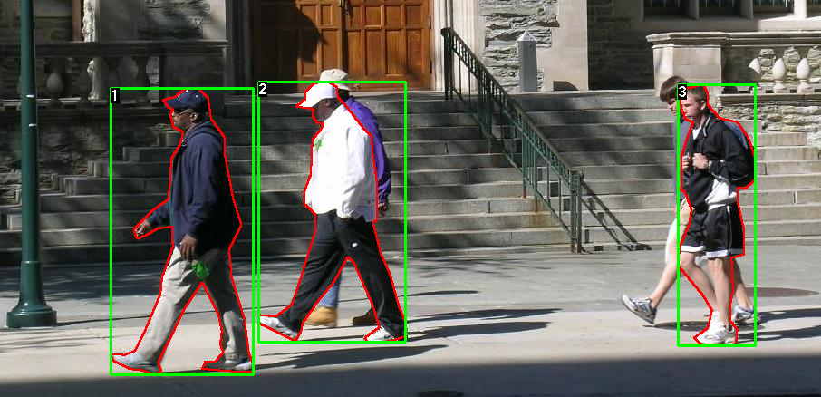

DEEP Open Catalogue: Object Detection and Classification
==============================

[](https://jenkins.indigo-datacloud.eu:8080/job/Pipeline-as-code/job/DEEP-OC-org/job/obj_detect_pytorch/job/master)

**Author:** Silke Donayre Holtz<br>
**Project:** This work is part of the [DEEP Hybrid-DataCloud](https://deep-hybrid-datacloud.eu/) project that has received funding from the European Union’s Horizon 2020 research and innovation programme under grant agreement No 777435.

This is a plug-and-play tool for object detection and classification using deep neural networks (Faster R-CNN ResNet-50 FPN Architecture) that were already pre-trained on the [COCO Dataset](http://cocodataset.org/#home). The code uses the Pytorch Library, more information about it can be found at [Pytorch-Object-Detection](https://pytorch.org/docs/stable/torchvision/models.html#object-detection-instance-segmentation-and-person-keypoint-detection). 

This module works on uploaded pictures and gives as ouput the rectangle coordinates (x1,y1) and (x2,y2) were the classificated object is located with its respective probability.

<p align="center">

</p>

For training, transferred learning is used. Transferred learning focuses on storing knowledge gained while solving one problem and applying it to a different but related problem. To achieve it, the output layer of the pre-trained model is removed and a new one with the new number of outputs is added. Only that new layer will be trained. An example of it is provided an implemented in this module.

The model requires a new dataset with the classes that are going to be classified and detected. In this case the [Penn-Fudan Database for Pedestrian Detection and Segmentation](https://www.cis.upenn.edu/~jshi/ped_html/) was used to detect pedestrians. 

<p align="center">

</p>

To try this in the module, the two dataset folders (Images and masks) must be placed in the `obj_detect_pytorch/dataset/` folder. More information about the code and the structuring of the custom dataset can be found at [Torchvision Object Detection Finetuning](https://pytorch.org/tutorials/intermediate/torchvision_tutorial.html).


Project Organization
------------

    ├── LICENSE
    ├── README.md              <- The top-level README for developers using this project.
    ├── data
    │   └── raw                <- The original, immutable data dump.
    │
    ├── docs                   <- A default Sphinx project; see sphinx-doc.org for details
    │
    ├── docker                 <- Directory for Dockerfile(s) for development
    │
    ├── models                 <- Trained and serialized models, model predictions, or model summaries
    │
    ├── notebooks              <- Jupyter notebooks. Naming convention is a number (for ordering),
    │                             the creator's initials (if many user development), 
    │                             and a short `_` delimited description, e.g.
    │                             `1.0-jqp-initial_data_exploration.ipynb`.
    │
    ├── references             <- Data dictionaries, manuals, and all other explanatory materials.
    │
    ├── reports                <- Generated analysis as HTML, PDF, LaTeX, etc.
    │   └── figures            <- Generated graphics and figures to be used in reporting
    │
    ├── requirements.txt       <- The requirements file for reproducing the analysis environment, e.g.
    │                             generated with `pip freeze > requirements.txt`
    ├── test-requirements.txt  <- The requirements file for the test environment
    │
    ├── setup.py               <- makes project pip installable (pip install -e .) so obj_detect_pytorch can be imported
    ├── obj_detect_pytorch    <- Source code for use in this project.
    │   ├── __init__.py        <- Makes obj_detect_pytorch a Python module
    │   │
    │   ├── dataset            <- Scripts to download or generate data
    │   │   └── make_dataset.py
    │   │
    │   ├── features           <- Scripts to turn raw data into features for modeling
    │   │   └── build_features.py
    │   │
    │   ├── models             <- Scripts to train models and then use trained models to make
    │   │   │                     predictions
    │   │   └── deepaas_api.py
    │   │
    │   └── tests              <- Scripts to perfrom code testing + pylint script
    │   │
    │   └── visualization      <- Scripts to create exploratory and results oriented visualizations
    │       └── visualize.py
    │
    └── tox.ini                <- tox file with settings for running tox; see tox.testrun.org


--------

 **Requirements:**
 
- This project has been tested in Ubuntu 18.04 with Python 3.6.5. Further package requirements are described in the `requirements.txt` file.
- It is a requirement to have [Pytorch>=1.3.0 installed](https://pytorch.org/get-started/locally/). 

<p><small>Project based on the <a target="_blank" href="https://drivendata.github.io/cookiecutter-data-science/">cookiecutter data science project template</a>. #cookiecutterdatascience</small></p>

## Workflow


### Test

You can test the posenet module on a number of tasks: predict a single local image file (or url) or predict multiple images (or urls). 


#### Running the API


To access this package's complete functionality (both for training and predicting) through an API you have to install the [DEEPaaS](https://github.com/indigo-dc/DEEPaaS) package:

```bash
git clone https://github.com/indigo-dc/deepaas
cd deepaas
pip install -e .
```

and run `deepaas-run --listen-ip 0.0.0.0`.
From there you will be able to run training and predictions of this package  using `model_name=posenetclas`.


